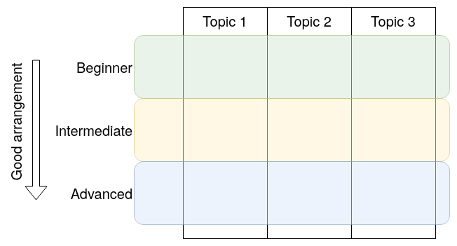
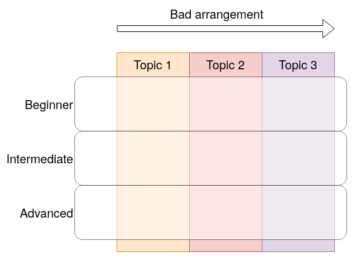

# Documentation Best Practices

(Status: This is still work in progress as of 2023-05-06.)

## 1. No-Criticism Principle

When I talk about the problems in the documentation (including online documents or published books) of any existing product, I have no intention to criticize or blame the developers of the product or the authors of the documentation. I'm merely trying to provide my thoughts about what the problems are and how they can be fixed in order to make the documentation better.

## 2. Motivation

I believe **efficient knowledge transfer is a vital factor for successful software development which is mostly done as a team effort**. Think about it in a mind experiment: if everyone can become an expert on everything, software development can be more likely to succeed because people know how to use the tools/libraries correctly and avoid the pitfalls of using them.

In reality, chances are everyone is just good in one or two areas. I can identify two scenarios where knowledge transfer is needed:

- 1). A junior member is recruited into the team, so some senior member needs to teach him/her.
- 2). In a team where members rotate the roles, one team member may need to teach another team member the things he/she has worked on in the recent past.

Efficient knowledge transfer can minimize the needed time to transfer the knowledge while the precision of the understanding of the transferred knowledge is still sustained. In other words, we want to spend time to transfer knowledge, not to transfer confusion or misunderstanding.

Another way of looking at this is: Efficient knowledge transfer is similar to running the "copy" command between two machines. Before "copy" is run, the file of knowledge only exists on one machine; after "copy" is run, an exact copy of this file exists on the second machine, too.

In software industry, documentation is an important means of transferring knowledge from the author of a software package to its potential users and prospective maintainers. The documentation can be as simple as a single `README` file or a whole site of documents.

Unfortunately, I've observed many such documents failing to achieve the goal of "efficient knowledge transfer": Typically, they fail to discuss the topic clearly enough and cause the readers either to be confused (thus have to spend more time to learn the material, hence wasting more time), or, worse, to think they "understand" the topic but in fact they really haven't.

This project, `Document Shredded`, aims at advocating the best practices of documentation and alerting the bad practices so we can make knowledge transfer more efficient.

## 3. What This Is

This is a repository that collects documentation good practices with examples and bad practices as counter-examples in order to show how to create easy-to-understand documentation.

Although this repository is created with software documentation in mind, I believe the practices are applicable to many other areas.

## 4. Who This Is For

This repository is primarily targeted to software developers who are usually not considered as a documentation writer. However, as I said above, I believe all the developers or engineers who work in the technological areas can get benefits from it.

## 5. Documentation Smells

Similar to [code smells](https://en.wikipedia.org/wiki/Code_smell), poor documentation has its smells too.

### 5.1 Lost in forest

This smell means the document does not provide an overview on the fundamental concepts of the subject and starts with details too soon. As a result, the readers may not have enough knowledge about the context and not be able to understand why a feature is designed and implemented in the particular way.

This issue may result in a steep learning curve because the readers have to figure out the big picture by themselves, and this process may take a lot of effort and time.

### 5.2 Lack of foundation

This smell means the document does not provide solid explanation of the fundamental knowledge before diving into deeper topics. This may not be an issue for non-beginner readers, but for beginner readers, this would result in a steep learning curve.

In contrast, for a good example that provides the readers a step-by-step guide to deeper and more complicated topics, see [_Essentials of Economics_](https://www.cengage.com/c/essentials-of-economics-8e-mankiw/9781337091992PF/) by Gregory Mankiw.

### 5.3 Spaghetti-like links

This smell means the document is full of links to other parts (especially the later parts) of the document. These links harm the understanding in two ways:
- Firstly, they can distract the readers from learning the current topic and get them lost in the "forest of links" quickly.
- Secondly, the constant links to later parts of the document shows that understanding of the earlier parts of the document may need the knowledge of the later parts, which then shows the document contents are arranged poorly.

A good document, in contrast, should start with the fundamental knowledge so the readers should be able to read from the first section all the way down to the last chapter without jumping back and forth among chapters. Sometimes, the document provides links to external sources, but:
- Ideally, these links should not point to the later parts of the same document.
- These links should point to external documents that the readers can but don't have to read in order to understand the current topic.

### 5.4 Too deep on one topic

It's usually a good practice to focus on one topic. However, for a complicated product, the explanation of one topic may inevitably involve the explanation of other topics. There are two dimensions regarding the arrangement of explanation: the topics and the required expertise levels. Therefore, it may be better to divide the explanation according to the expertise level first, then by the topics. The good arrangement looks like the diagram below:

The bad arrangement looks like the diagram below:

Bad example: _A Practical Guide to TPM 2.0_: Chapter 9 and onwards are arranged by topics, but each chapter delves a bit too deep for a beginner reader.

### 5.5 Reference without Definition

See the section ["Control Machine Requirements"](https://docs.ansible.com/ansible/latest/installation_guide/intro_installation.html#control-machine-requirements) of Ansible's documentation. This section is the first time the term "control machine" is used, but there is no definition or explanation of what a "control machine" is. The reader needs to infer it from the context.

### 5.6 Inconsistent terminology

This smell means the document use terms that look similar but slightly different to refer to the same concept or not. The problem is the terms look similar so the readers may think they refer to the same concept, but the readers are not sure. This is usually because of two reasons:
- The context does not provide enough clue for the readers to tell whether they really refer to the same concept or they refer to two concepts that happen to look similar.
- The readers are not familiar with the area so they don't have the knowledge to tell whether the similar terms refer to the same concept or not. This may not be an issue for non-beginner readers.

This can also result in steep learning curve, because the readers need to make extra efforts.

Take _A Practical Guide to TPM 2.0_, Chapter 8 "TPM Entities" for example. This chapter has a section "Nonpersistent Entities" that talks about nonpersistent entities. This section never mentions the term "transient entity". One page later, in the section "Entity Names", in "EXAMPLE: ATTACKER READING A SECRET", it says "The Name of a transient or persistent entity is also a digest of its public area." This is the first place that mentions "transient" in the whole book. Because the word "transient" is put side by side with "persistent", it gives the readers a hint that "transient" and "nonpersistent" are equivalent. Far down in the Chapter 18 "Context Management", the whole chapter uses "transient" all the time.

This is not a good documenting practice for a few reasons:
- The only place that connects "transient" and "nonpersistent" is the sentence "The Name of a transient or persistent entity is also a digest of its public area." This is a weak connection, not to mention the readers may skip the examples.
- It's true that "nonpersistent" and "transient" may mean similar in English, and any fluent English readers may naturally connect them. However, this relies on the readers' ability to connect them. If the readers don't, they would get confused and don't know whether a "transient entity" is the same as "nonpersistent entity".
- "Nonpersistent" is only used in Chapter 8. "Transient" is used through in Chapter 18. Why not just use "transient" through the entire book? A possible reason is: the two chapters were written by different authors of the book, so there was not enough coordination in the terminology they used.
- Should the book have written a more clear sentence like "A transient entity is a nonpersistent entity" or "A nonpersistent entity is also called a transient entity", it would be much easier for the readers to understand them firmly.

## 6. Best Practices

Realizing the bad documentation smells is important, but it's not sufficient. We also need to know what good documentation looks like.

### 6.1 Provide an overview on the fundamental concepts

Provide an overview on the fundamental concepts to lay a good foundation for the readers of why a certain thing is done in a certain way. A good example is the [_SVN Book: Chapter 1. Fundamental Concepts_](https://svnbook.red-bean.com/en/1.7/svn.basic.html). [_Mastering CMake: Key Concepts_](https://cmake.org/cmake/help/book/mastering-cmake/chapter/Key%20Concepts.html#key-concepts) is the same attempt but I don't think the key concepts there are sufficient: they still miss some concepts I think are important for readers to understand the tool.

### 6.2 Arrange contents for different purposes

This article ["What nobody tells you about documentation"](https://www.divio.com/blog/documentation/) is a must-read! It separates the documentation into four quadrants, each of which takes a different responsibility:

> - Tutorials
>   - is **learning-oriented**
>   - allows the newcomer to get started
>   - is a lesson
> - How-to guides
>   - is **goal-oriented**
>   - shows how to solve a specific problem
>   - is a series of steps
> - Explanation
>   - is **understanding-oriented**
>   - explains
>   - provides background and context
> - Reference
>   - is **information-oriented**
>   - describes the machinery
>   - is accurate and complete

The great thanks go to [Daniele Procida](https://twitter.com/evildmp) who makes it so clear and concise!

With the above-mentioned four documentation quadrants, I find many documentations are poor because of the lack in "Explanation": they provide a lot of tutorials and how-to guides but fail to give a conceptual explanation of the product components and how and **especially why** they are put that way.

I **strongly believe** understanding `why`s is crucial to using the product correctly, because those `why`s reflect the problems the product is solving. Not understanding the `why`s may result in using the product in the wrong context to solve the wrong problem.

### 6.3 Use a hybrid mode of top-down and bottom-up

When it comes to explaining a technology, the single top-down or bottom-up approach may not always work the best. My personal experience is one probably needs to mix them: sometimes, give the readers an overview of the part to be introduced; sometimes, explain the low-level building blocks and aggregate them into the final topic.

This is needed probably because the knowledge is not always in a tree structure but in a network structure, so different parts of the network need different methods to explain.

## Useful Links

- [14 Examples of Documentation Mistakes You Are Making](http://blog.screensteps.com/14-examples-of-bad-documentation)
- [Poor Documentation: Why It Happens and How to Fix It](http://www.fortherecordmag.com/archives/0516p12.shtml)
- [Documentation Bad Habits: Shortcuts in Electronic Records Pose Risk](http://library.ahima.org/doc?oid=81008#.W1uFmnXwbdE)
